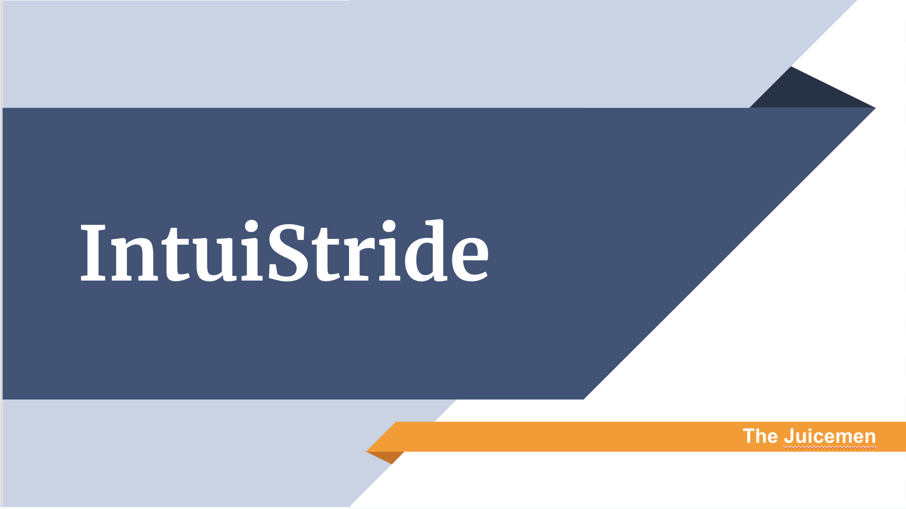

### About me
Hello there! I'm an undergraduate senior and progressive master's student @ USC studying cognitive science, informatics, and computer science! I love everything about development--the process of learning new languages & technologies, collaborating with others, and making an impact with the things we create. Over the past few years I've had some amazing opportunities to intern at [IBM](https://www.ibm.com/products/aspera) and [Automation Anywhere](https://www.automationanywhere.com/company/about-us) and am actively looking for Summer 2021 development internships!

In my freetime I enjoy nerding out about Star Wars, hanging out with the amazing kids of [USC Troy Camp](http://www.troycamp.org/), boxing, and playing volleyball. Thanks for visiting, and feel free to reach out  at vehling@usc.edu or connect with me on [LinkedIn](https://www.linkedin.com/in/elisabeth-vehling)!

~ Elisabeth

# Projects
## Hackathons
### UNBI
*IBM North America Intern Hackathon, 2020*

Over the course of a few days, 4 other IBM interns and I developed a web service that automatically identifies and redacts racially identifying information from police reports. The goal of this project was to reduce the effects of implicit bias during prosecution. See our final project presentation [here](https://www.youtube.com/watch?v=FAJ6HNLSHcw)!

*Tools*: Python, JavaScript, IBM Watson Natural Language Classifier API, Microsoft Computer Vision API

--- 

### WebDM
*HackSC, 2020*

3 other students created a chrome plugin, [WebDM](https://github.com/evehling/webdm,that aims to make the process of "googling" medical symptoms more informed and accessible to everyone. Here's a quick demo of how the backend uses NLP to classify users' colloquial queries into medical classes.

*Tools*: JavaScript, Python, ngrok, Flask, SpaCy

*Disclaimer: For demo purposes only--this is not to be used in place of a doctor!*
---

### IntuiStride (First Place)
*ASBME Makeathon, 2019*

Myself and an interdisciplinary team of 4 other USC Viterbi students developed a working assistive device in 48 hours. The device is a functioning walker embedded with an automatic braking system and haptic feedback designed to allievate common Parkinsons' symptoms. [Here's](https://viterbischool.usc.edu/news/2019/03/the-future-of-med-tech-innovation-in-just-48-hours/) a cool article about our project!

*Tools*: Arduino, C

---
## Ahmanson Lab Projects
The USC Sydney Harman Academy for Polymathic study has been an incredible place to have the opportunity to be involved in for the last few years. The Ahmanson Lab is a part of the Harman Academy that funds and organizes annual projects. From 2018-2019, I was an [Ahmanson Lab innovation scholar](https://polymathic.usc.edu/ahmanson-lab/innovation-scholars/ahmanson-lab-innovation-scholars-2018-2019) where I worked on the Terraforming Mars collaboratory and am still involved with the Neural Sound Resynth working group.

### Terraforming Mars
*USC Ahmanson Lab*

As a part of a year long project, [Terraforming Mars](https://polymathic.usc.edu/ahmanson-lab/collaboratories/ahmanson-lab-collaboratories-2018-2019), our interdisciplinary team of 5 students and 4 mentors conducted research on plant growth in closed environments as well as developed a [VR simulation](https://github.com/ahmanson-lab/terraforming-mars-vr) of Martian habitat. 

 
---

### Neural Sound Resynth
*USC Ahmanson Lab*

An ongoing [project](https://polymathic.usc.edu/ahmanson-lab/ahmanson-lab-working-groups), several other USC students and I are in the process of developing the hardware and software components of a synthesizer optimized with neural networks. [Here's](https://github.com/succculent/resynth) our project so far.

*Tools*: C++, Dlib, CPython, Maximillian, PureData, STK, Python

---
## Data Science
> I'm still working on compiling everything with demos + screenshots which has taken a back seat since school started :-) Some of my favorite past projects include recoloring images using CNNs, classifying time series' of bodily movements, and classifying potential breast cancer cases. [Here's](https://github.com/evehling/DataScience) the github repo for all of my projects so far.

---

## Entrepreneurship
### Squad.
*USC SEP Kappa Pitch Competition*

Squad is a mobile application designed to make planning meet ups with family and friends easier and faster. See the pitch deck [here](https://docs.google.com/presentation/d/1e3_VjcWom2szqyCH4v73wUhQ-P4Wqk0xAiEm1RfdWPg/edit?usp=sharing)! 

--- 

### Scale
*Troy Labs, 2019*
For 2019 I served as Vice President of Scale, the startup consulting wing of [USC Troy Labs](https://www.troylabs.vc/). We worked with 3 startups in the span of the year and provided research and consulting services on scaling their businesses in the USC student community.

---

# Skills
## Languages

### Most Familiar
- C/C++
- Python
- Java
- JSON/YAML

### Pretty Familiar
- x86 assembly
- HTML
- CSS
- SQL

### A Little Rusty
- C#
- Node.js
- MATLAB
- mySQL

---
## Tools
### Version Control
- git
- gitLab
- ArgoCD

### Command Line
- git
- vim
- nano
- gdb
- valgrind
- kubectl
- istioctl
- cmake

### Containerization
- Kubernetes
- Docker
- kind
- helm

---
## Language-Specific
### Python
**Data Science**
- Jupyter Notebooks/Colab
- scipy
- pandas
- numpy
- scikit-learn
- matplotlib

**Other**
- itertools
- flask
- SpaCy

### C++
- gtest
- Maximillian
- dlib

### HTML/CSS
- Bootstrap

### C#
- .NET

